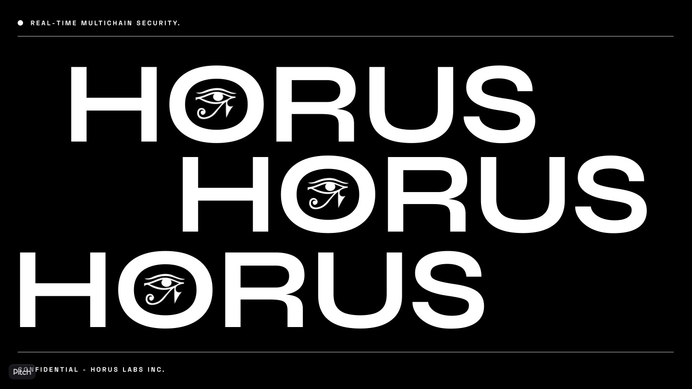

**Horus** is a blockchain built using Cosmos SDK and Tendermint.

### Ignite CLI Installation

We use Ignite CLI and its relayer to manage and run multiple instances of Horus chains and manage IBC relaying between them.

To install the latest version of the Ignite CLI (and thereby Ignite Relayer), execute the following command on your machine:

```
curl https://get.ignite.com/cli@nightly! | bash
```

### Horus Dashboard

The Horus dashboard provides a visualization of the chain that Horus monitors, provides information about the chain, and display the IBC inbox/outbox for each chain. To use it, do the following:

```
cd client
yarn install
yarn add
```

## Demo

Setup & pre-shutdown demonstration!

### Boot up three chains, Earth, Mars and Horus

```
ignite chain serve -c earth.yml
ignite chain serve -c mars.yml
ignite chain serve -c horus.yml
```

### Set up two IBC relayer connections

**Delete relayer cache**

```
  rm -rf ~/.ignite/relayer
```

**Configure Earth → Mars IBC connection**

```
 ignite relayer configure -a \
 --source-rpc "[http://0.0.0.0:26657](http://0.0.0.0:26657/)" \
 --source-faucet "[http://0.0.0.0:4500](http://0.0.0.0:4500/)" \
 --source-port "blog" \
 --source-version "blog-1" \
 --source-gasprice "0.0000025stake" \
 --source-prefix "cosmos" \
 --source-gaslimit 300000 \
 --target-rpc "[http://0.0.0.0:26661](http://0.0.0.0:26661/)" \
 --target-faucet "[http://0.0.0.0:4502](http://0.0.0.0:4502/)" \
 --target-port "blog" \
 --target-version "blog-1" \
 --target-gasprice "0.0000025stake" \
 --target-prefix "cosmos" \
 --target-gaslimit 300000
```

**Configure Earth → Horus IBC connection**

```
  ignite relayer configure -a \
  --source-rpc "[http://0.0.0.0:26657](http://0.0.0.0:26657/)" \
  --source-faucet "[http://0.0.0.0:4500](http://0.0.0.0:4500/)" \
  --source-port "blog" \
  --source-version "blog-1" \
  --source-gasprice "0.0000025stake" \
  --source-prefix "cosmos" \
  --source-gaslimit 300000 \
  --target-rpc "[http://0.0.0.0:26659](http://0.0.0.0:26659/)" \
  --target-faucet "[http://0.0.0.0:4501](http://0.0.0.0:4501/)" \
  --target-port "blog" \
  --target-version "blog-1" \
  --target-gasprice "0.0000025stake" \
  --target-prefix "cosmos" \
  --target-gaslimit 300000
```

**Start relayers**

```
 ignite relayer connect
```

### Test IBC connection

**Send a test IBC message**

```
planetd tx blog send-ibc-post blog channel-1 "Hello" "Hello Mars, I'm Alice from Earth" --from alice --chain-id earth --home ~/.earth
```

**Show that Mars stores the IBC post**

```
planetd q blog list-post --node tcp://localhost:26659
```

**Show that Earth receives the ack**

```
planetd q blog list-sent-post
```

### Mallory attacks!

Now a user, Mallory will send a malicious message, which will break the invariant set by Earth’s governance.

**Send an IBC post from Earth to Mars by Mallory (malicious)**

```
planetd tx blog send-ibc-post blog channel-1 "Some Malicious Message" "This is an exploit! (Hidden)" --from mallory --chain-id earth --home ~/.earth
```

**Show that Mars stores the IBC post**

```
planetd q blog list-post --node tcp://localhost:26659
```

**Show that Earth receives the ack**

```
planetd q blog list-sent-post
```

### Horus intervention

We now know some malicious activity has occurred that has broken an invariant that Horus was set to protect on the consumer chain, Earth. Now a Horus validator, now seeing that this activity has occurred (via a ping to an RPC endpoint on their own full node), will pause IBC bridging outbound from Earth. This will pause IBC for all accounts, not just Mallory but also for accounts like Alice.

**Shut down Earth sending IBC posts via the Eye Interchain Account on Horus via BridgeShutdown message**

```
planetd tx blog send-ibc-horus-action blog channel-0 "No more IBC for Earth" "BridgeShutdown" --from eye --chain-id horus --home ~/.horus --node tcp://localhost:26661
```

**Show that Mallory can no longer send IBC message to Mars**

```
planetd tx blog send-ibc-post blog channel-1 "Exploit Entendre" "Are you ready for Part 2?" --from mallory --chain-id earth --home ~/.earth
```

**Show that Alice can no longer send IBC message to Mars**

```
planetd tx blog send-ibc-post blog channel-1 "Hello Pt. 2" "Hello Earth, I'm Bob from Mars" --from alice --chain-id earth --home ~/.`earth
```

**List Sent Actions on Horus**

```
planetd q blog list-sent-action --node tcp://localhost:26661
```

### Restore chain connection

Now, after checking that the validators of the consumer chain have confirmed that normal chain activity has been restored (no more malicious action), Horus can resume bridging outbound from Earth.

**Re-start Earth IBC bridge with Alice account on Horus via BridgeRestore message**

```
planetd tx blog send-ibc-horus-action blog channel-0 "The Return of the IBC" "BridgeRestore" --from eye --chain-id horus --home ~/.horus --node tcp://localhost:26661
```

```
planetd q blog list-sent-action --node tcp://localhost:26661
```

**Send IBC post from Earth to Mars by Alice**

```
planetd tx blog send-ibc-post blog channel-1 "Please be back online" "I hope you can store this!" --from alice --chain-id earth --home ~/.earth
```

**Show Mars stores the IBC post**

```
planetd q blog list-post --node tcp://localhost:26659
```

### Conclusion

As we’ve seen in the demo, chains like Earth can set invariants via governance, which when broken, can be acted upon by Horus validators.

In doing so, Horus provides a flexible and modular solution to Cosmos chain security.
